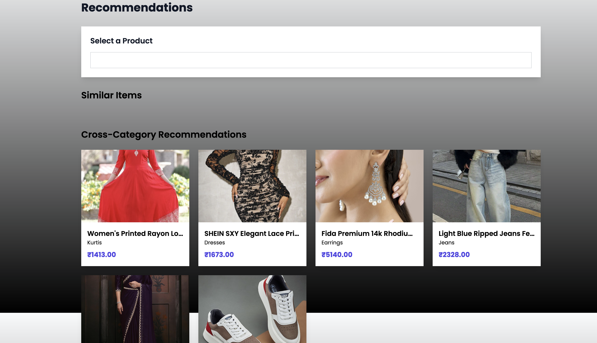

# Universal Fashion Ontology & Feature Extraction System

## **Overview**
The **Universal Fashion Ontology & Feature Extraction System** is a cutting-edge AI-driven solution designed to revolutionize the way fashion products are understood, categorized, and analyzed. Our system integrates advanced multi-modal AI techniques with a comprehensive, adaptive ontology to create a universal "language" for fashion. By combining textual and visual feature extraction, trend analysis, and personalized recommendations, the system empowers businesses, designers, and retailers to navigate the complexity of the global fashion industry with precision and scalability.

---

## **Key Features**

### **1. Comprehensive Fashion Ontology**
- **Hierarchical Structure:** Captures the intricate relationships between categories, attributes, and features of fashion products.
- **Dynamic Adaptation:** Automatically expands and evolves to incorporate new trends and keywords, ensuring relevance over time.

### **2. Advanced Multi-Modal Feature Extraction**
- **Textual Analysis:** Extracts meaningful attributes from product descriptions, meta-info, and feature lists.
- **Visual Analysis:** Leverages embeddings to understand visual features, enabling cross-category insights and recommendations.

### **3. Search and Filtering**
- Intuitive interface for querying and filtering products by brand, category, attributes, and more.
- Supports natural language queries for seamless user experience (e.g., *"Show all quartz-material bathroom vanities"*).

### **4. Personalized Recommendations**
- **Similarity-Based:** Recommends products based on embeddings for similar attributes and features.
- **Cross-Category:** Suggests complementary products (e.g., "Shirts that match these jeans").

### **5. Trend Analysis**
- Identifies emerging fashion trends through temporal and categorical analysis.
- Visualizes popular features, materials, and categories using interactive dashboards.

### **6. Continuous Learning & Feedback Integration**
- Learns from user interactions, feedback, and expert annotations.
- Ensures consistent improvement in feature extraction and recommendation precision.

---

## **System Workflow**
1. **Data Ingestion:** Input dataset of 100K+ fashion products across categories, departments, and brands.
2. **Ontology Creation:** Generate a detailed, hierarchical representation of fashion attributes.
3. **Feature Extraction:** Analyze text and images to extract key attributes.
4. **Knowledge Graph Construction:** Store extracted features, relationships, and embeddings in a Neo4j-based knowledge graph.
5. **Recommendations & Trends:** Use graph queries and embeddings to generate recommendations and trend insights.
6. **Continuous Adaptation:** Incorporate new trends and feedback into the ontology and feature extraction pipeline.

---

## **Use Cases**
- **Retail & E-commerce:** Enhanced product search, filtering, and personalized recommendations.
- **Design & Manufacturing:** Insights into trending features and materials for informed decision-making.
- **Marketing:** Data-driven trend analysis for targeted campaigns.

---

## **Future Scope**
- Expand the system to support real-time updates for fast-evolving fashion trends.
- Incorporate tactile features (e.g., fabric texture) as an additional modality.
- Develop APIs for seamless integration with retail and e-commerce platforms.

---

## **How to Use the Prototype**

### **1. Install Dependencies**
First, ensure you have Node.js installed. Then, install the necessary dependencies for the Next.js application:
```bash
npm install
```

### **2. Run the Application**
Start the Next.js development server:
```bash
npm run dev
```
The application will be available at `http://localhost:3000`.

### **3. Configure Neo4j and OpenAI**
Navigate to the `notebooks` folder and open the Jupyter notebook. Fill in your Neo4j database details and OpenAI API key in the respective cells:
```python
# Neo4j configuration
NEO4J_URI = "bolt://<your-neo4j-uri>"
NEO4J_USER = "<your-username>"
NEO4J_PASSWORD = "<your-password>"

# OpenAI API key
OPENAI_API_KEY = "<your-openai-api-key>"
```

### **4. Run the Jupyter Notebook**
Launch Jupyter Notebook and run all cells to initialize the system:
```bash
jupyter notebook
```

---

## **Frontend Features**
1. **Ontology Explorer:** Interact with a dynamic visualization of the fashion ontology.
2. **Search & Filter:** Query products by attributes, brand, and more.
3. **Recommendations:** View similar and cross-category product suggestions.
4. **Trend Dashboard:** Analyze and visualize fashion trends over time.

### **Demo Data**
The prototype uses simulated data from the provided dataset to demonstrate core functionality.
The screenshots are below:


*Ontology Explorer*


*Search & Filter*


*Recommendations*


*Trend Dashboard*


*Landing Page*


*Product Details*

---

## **Acknowledgments**
This project was developed as part of Stylumia NXT Hackathon. Special thanks to mentors, advisors, and contributors for their invaluable support and guidance.

---

## **Contact**
For inquiries, please contact pratham.shirbhate22@spit.ac.in.

